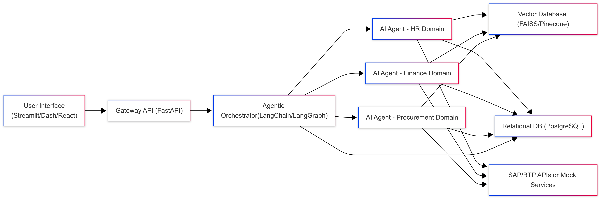

# Project Architecture

This document outlines the high-level architecture for the Autonomous SAP Workflow Orchestrator Powered by Generative AI Agents.

---

## System Overview

The system allows users to request SAP business processes in natural language. Via a frontend dashboard, requests are submitted to an API that orchestrates a series of specialized AI agents (for HR, Finance, Procurement, etc.). These agents communicate with both structured (relational) and unstructured (vector) data sources, and execute tasks by calling SAP APIs. Workflow status and results are continuously tracked and presented to the user.

---

## Component Diagram

## Component Explanations

- **User Interface:** Allows natural language input and shows workflow statuses.
- **Gateway API:** FastAPI service to receive and route requests.
- **Agentic Orchestrator:** Core logic (LangChain/LangGraph) that breaks requests into subtasks, selects appropriate agents.
- **AI Agents:** Microservices handling domain-specific tasks by accessing data and/or SAP functionality.
- **Vector Database:** Stores semantic document embeddings for AI-powered retrieval.
- **Relational DB:** Manages workflow states, structured records, and logs.
- **SAP APIs:** Real or mocked endpoints for SAP process execution.
